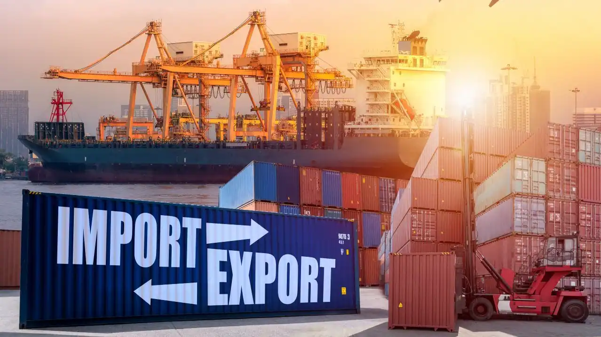

Certainly! Here is an **attractive and engaging README** for your **Indian Imports and Exports Data Analysis** project. This template includes placeholders for images and graphs, which you can replace with actual images or links to images from your repository.

---

# 📦 **Indian Imports and Exports Data Analysis** 🇮🇳

  
**A Comprehensive Analysis of India's Imports and Exports**

Welcome to the **Indian Imports and Exports Data Analysis** repository! This project aims to provide detailed insights into India's international trade by analyzing its imports and exports data. We explore key trends, top trading partners, product categories, and much more to understand the flow of goods in and out of India.

## 🚀 Project Overview

The goal of this project is to:
- **Analyze Trends**: Identify growth patterns in imports and exports over time.
- **Top Trading Partners**: Explore India’s top export and import destinations.
- **Product Category Analysis**: Investigate key product categories involved in India’s trade.
- **Regional Performance**: Understand how different regions contribute to India’s trade.

These insights can help policymakers, businesses, and stakeholders in making informed decisions.

## 📊 Dataset

The dataset used in this analysis contains information about India's imports and exports across multiple categories:
- **Year**: The year the trade took place.
- **Country**: The trading partner country.
- **Product Category**: The type of product being traded (e.g., electronics, textiles).
- **Trade Value**: The monetary value of the trade.
- **Import/Export**: Whether the trade was an import or an export.

## 🛠️ Tools & Technologies

This project uses the following technologies:
- **Python**: For data manipulation and analysis.
- **Pandas**: For data wrangling and cleaning.
- **Matplotlib & Seaborn**: For visualizations and charts.
- **Jupyter Notebooks**: Interactive environment for running and displaying the analysis.

## 🔧 Installation

To get started with this project, follow these steps:

1. **Clone the repository**:
   ```bash
   git clone https://github.com/ShubhamMvernekar/Indian-Imports-and-Exports-data-analysis.git
   cd Indian-Imports-and-Exports-data-analysis
   ```

2. **Install dependencies**:
   - Create a virtual environment (optional but recommended):
     ```bash
     python -m venv venv
     source venv/bin/activate  # On Windows, use `venv\Scripts\activate`
     ```
   - Install required libraries:
     ```bash
     pip install -r requirements.txt
     ```

3. **Run Jupyter Notebook**:
   ```bash
   jupyter notebook
   ```

4. **Explore the analysis** by opening the Jupyter notebook.

## 📂 Project Structure

Here’s how the project is organized:
- `data/`: Contains the raw dataset of India’s imports and exports.
- `notebooks/`: Jupyter notebooks where the data analysis and visualizations are performed.
- `requirements.txt`: List of all required Python dependencies for the project.
- `README.md`: This file, explaining the project and how to use it.

## 🔍 Key Insights & Analysis

### 1. **Imports and Exports Trends**
We analyze the growth of India's imports and exports over time to spot key trends and fluctuations.

#### Example Visualization: Trade Growth Over Time
  
*Line chart showing the growth of imports and exports over the years.*

#### Example Code:
```python
import pandas as pd
import matplotlib.pyplot as plt

# Load the data
df = pd.read_csv('data/india_trade.csv')

# Group by Year to see the trend
annual_trade = df.groupby(['Year', 'Import/Export'])['Trade Value'].sum().unstack()

# Plotting the trade trends
plt.figure(figsize=(10, 6))
annual_trade.plot(kind='line', marker='o')
plt.title('India Imports and Exports Trend')
plt.xlabel('Year')
plt.ylabel('Trade Value (INR Billion)')
plt.grid(True)
plt.xticks(rotation=45)
plt.legend(['Imports', 'Exports'])
plt.show()
```

### 2. **Top Trading Partners**
This analysis highlights the countries that India trades the most with, both in terms of imports and exports.

#### Example Visualization: Top Trading Partners
  
*Bar chart showing the top 10 trading partners of India.*

#### Example Code:
```python
# Get the top trading partners for imports and exports
top_trading_partners = df.groupby(['Country', 'Import/Export'])['Trade Value'].sum().unstack().fillna(0)
top_trading_partners = top_trading_partners.sort_values(by='Exports', ascending=False).head(10)

# Plotting the top trading partners
top_trading_partners['Exports'].plot(kind='barh', color='royalblue', figsize=(10, 6), title='Top 10 Trading Partners for India (Exports)')
plt.xlabel('Trade Value (INR Billion)')
plt.ylabel('Country')
plt.show()
```

### 3. **Product Category Analysis**
Understanding the major product categories involved in India’s trade is crucial for identifying sectors that drive imports and exports.

#### Example Visualization: Product Categories Breakdown
  
*Pie chart showing the distribution of product categories in India’s trade.*

#### Example Code:
```python
# Group by Product Category to get the trade value distribution
category_trade = df.groupby('Product Category')['Trade Value'].sum().sort_values(ascending=False)

# Plotting product category distribution
category_trade.plot(kind='pie', autopct='%1.1f%%', figsize=(8, 8), title="Trade Distribution by Product Category")
plt.ylabel('')
plt.show()
```

### 4. **Regional Trade Performance**
This analysis provides insights into how different regions contribute to India’s total trade value.

#### Example Visualization: Regional Trade Performance
  
*Bar chart comparing India’s trade performance across different regions.*

#### Example Code:
```python
# Group by Region and Trade to get total trade value
region_trade = df.groupby(['Region', 'Import/Export'])['Trade Value'].sum().unstack().fillna(0)

# Plotting the regional trade performance
region_trade.plot(kind='bar', figsize=(10, 6), title='India Trade Performance by Region')
plt.xlabel('Region')
plt.ylabel('Trade Value (INR Billion)')
plt.xticks(rotation=45)
plt.legend(['Imports', 'Exports'])
plt.show()
```

## 🍕 Sample Visualizations

### **Trade Value by Product Category**
  
*Pie chart displaying trade value distribution across product categories.*

### **Trade Performance by Country**
  
*Bar chart showing India’s trade value by the top 10 countries.*

## 🤝 Contributing

We welcome contributions to this project! If you would like to enhance the analysis, add more visualizations, or improve the data processing steps, feel free to fork the repository and submit a pull request.

If you have any suggestions, bug reports, or feature requests, please open an issue, and we'll get back to you as soon as possible.

## 📜 License

This project is licensed under the **MIT License**. See the [LICENSE](LICENSE) file for more details.

---

### 📦 Thanks for exploring the **Indian Imports and Exports Data Analysis** project! 🌍

We hope this project provides valuable insights into India's international trade and helps drive better policy-making and business decisions. Enjoy exploring the data! 😊

---

### Notes:
- **Replace the placeholder images** (e.g., `https://via.placeholder.com/600x300?text=Trade+Growth+Over+Time`) with actual images that you can upload to your repository.
- You can use the GitHub "Upload files" feature to add images to your repository and link them in the README.

This **Indian Imports and Exports Data Analysis** README should now be visually appealing and well-organized. Let me know if you'd like further adjustments or help with any other parts of the project!
